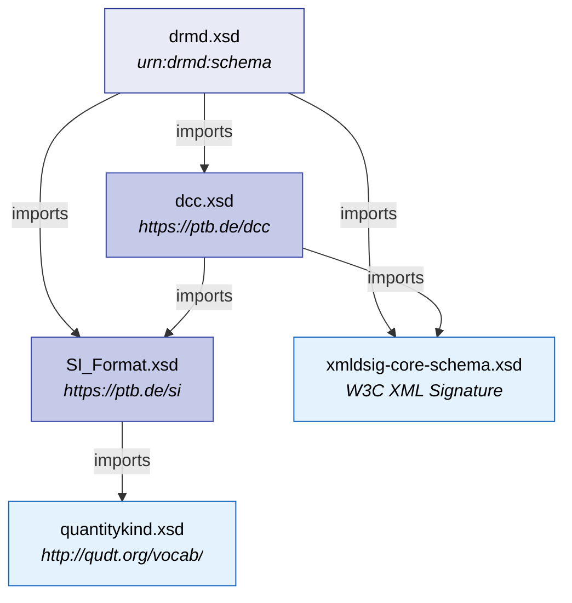

# Schema Overview & Architecture

The DRMD schema is designed to be read by software first and by people second, without either
losing out. It is organised into **six containers** under a single root element, each answering
one question about the reference material.

## The six containers

!!! abstract "1. Administrative Data (`administrativeData`)"
    Who issued this document, what it is, and how long it is valid. Holds the document title
    (which decides the document type), the document identifier, the document version, the
    validity period, the producer's name and contact details, and the responsible persons,
    including the approving officer a certificate must name.

!!! abstract "2. Materials (`materials`)"
    Which physical reference material or materials this document describes. Holds the name, the
    description, optional classifications, the minimum sample size, packaging quantities, and the
    identifiers of the RM itself (product code, batch or lot number).

!!! abstract "3. Properties (`propertiesList`)"
    The measurement data. Holds certified and informative property sets, distinguished by the
    `@isCertified` attribute, with their values, units, uncertainties, the measurement procedures
    used, and the identifiers that say which analyte or measurand each value refers to.

!!! abstract "4. Statements (`statements`)"
    Everything the user needs to know that is not a number: intended use, commutability, storage
    conditions, handling instructions, metrological traceability, health and safety information,
    legal notices and the reference to the certification report.

!!! abstract "5. Comments & Documents (`comment`, `document`)"
    An optional free-text note and an optional embedded file, normally a PDF rendition of the
    same certificate, so that the machine-readable and human-readable forms travel together.

!!! abstract "6. Digital Signature (`ds:Signature`)"
    One or more W3C XML Signatures, giving cryptographic evidence of who issued the document and
    that it has not been altered since.

---

## XML namespaces

DRMD defines only what is specific to reference materials. Everything else is borrowed from
established standards, so that a system which already reads digital calibration certificates can
reuse most of its code.

| Prefix | Namespace URI | Supplies |
|---|---|---|
| `drmd` | `urn:drmd:schema` | The DRMD-specific elements |
| `dcc` | `https://ptb.de/dcc` | Digital Calibration Certificate: multilingual text, rich content with attachments and formulas, contacts, responsible persons, embedded binary data, used methods, and the quantity container that `drmd:quantityType` extends |
| `si` | `https://ptb.de/si` | Digital System of Units (D-SI): every numeric value, unit and measurement uncertainty |
| `qudt` | `http://qudt.org/vocab/` | QUDT quantity kinds, reached **through** D-SI rather than imported directly (see [Units, Quantities & Uncertainty](units_quantities.md)) |
| `ds` | `http://www.w3.org/2000/09/xmldsig#` | W3C XML Signature |

!!! warning "The DRMD namespace is a URN, not a URL"
    The DRMD namespace is `urn:drmd:schema`. It is a URN because no permanent project domain has
    been assigned yet, and it is **not** resolvable, nothing is served at that address, and
    nothing should try to fetch it.

    Match elements by namespace URI plus local name, never by prefix. Prefixes are chosen by
    whoever wrote the document and carry no meaning.

### How the dependencies fit together



Read the arrows carefully: **QUDT is not optional decoration.** D-SI declares
`si:quantityTypeQUDT` with the type `qudt:quantitykind`. If that type cannot be resolved, an
element declaration inside D-SI refers to a type that does not exist, and the whole of `drmd.xsd`
is rejected, not just the QUDT part.

All five files are committed in the schema repository under `supporting/`, and `catalog.xml`
redirects the remote addresses inside `dcc.xsd` and `SI_Format.xsd` to those local copies. This
matters for two reasons:

* **Validation works with no network access.** Without the catalog, a validator either needs to
  reach `ptb.de`, or it silently skips the imports and then fails to compile the schema.
* **Validation is reproducible.** A fetched schema can change between runs, so two people could
  otherwise reach different verdicts on the same document.

```bash
export XML_CATALOG_FILES=/path/to/schema/catalog.xml
xmllint --noout --nonet --schema drmd.xsd my-document.xml
```

---

## Versioning

Every document declares the specification version it follows, in the root element:

```xml
<drmd:digitalReferenceMaterialDocument
    xmlns:drmd="urn:drmd:schema"
    schemaVersion="1.0.0">
```

The current version is **1.0.0**, the first release. Software should check the major version
before parsing and refuse a major version it does not know, because a major increment means the
structure has changed in a way that breaks existing parsers. Minor and patch increments are
backward compatible, so a parser should read what it recognises and ignore elements it does not.
See [Versioning](versioning.md) for the full policy.
