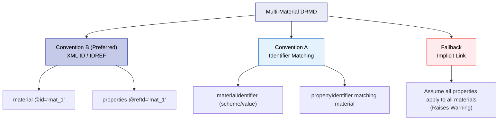

# Cross-reference & Identifier Conventions

The DRMD schema provides identifier structures and optional XML linking attributes (`@id`, `@refId`, `@refType`), but it does not strictly enforce a single linking model. Without agreed conventions, different software systems may interpret the same DRMD differently.

The goal of these conventions is to ensure that:
- Materials can be identified reliably across systems.
- Properties (measurands/analytes) can be mapped unambiguously.
- Multi-material documents can be processed deterministically.
- Automated imports do not create duplicate records in LIMS or instrument libraries.

!!! note "Validation Context"
    These are best-practice architecture rules for software implementation. They are not strictly enforced by Schematron rules, but following them is critical for Profile A and Profile B interoperability.

---

## 10.1 Canonical Keys (Stable Identifiers)

For any identifier element of type `drmd:identifierType`, the **canonical machine key** is always a tuple:

`CanonicalKey = (scheme, value)`

These two fields are mandatory in the schema. Relevant locations include:
- `documentIdentifiers`
- `materialIdentifiers`
- `organizationIdentifiers`
- `propertyIdentifiers`

### 10.1.1 Normalization (Recommended)

To improve matching across systems, consumers SHOULD normalize identifiers during ingestion:

| Field | Normalization Rule |
|-------|--------------------|
| `scheme` | Trim whitespace; compare case-insensitively (unless the publisher explicitly uses case-sensitive schemes). |
| `value` | Trim whitespace; preserve the original string; compare according to the specific scheme's rules (some values are case-sensitive). |

**Producers SHOULD avoid:**
- Using multiple spellings for the same scheme (e.g., mixing "CAS", "cas", and "CASRN").
- Placing human-readable descriptions inside the `value` element.

### 10.1.2 The Optional Link
`drmd:identifierType/link` SHOULD be used when there is a stable public resolver (a DOI URL, a ROR
URL, a CAS link). Consumers MAY use `link` for display, but **MUST NOT** rely on it for identity
matching: the resolver can move, and two identifiers can share a landing page.

### 10.1.3 `@refType` (two vocabularies, two behaviours)

`@refType` classifies what a reference means. It does **not** behave the same way everywhere, and
the difference catches people out.

| Where | Type | Permitted values |
|---|---|---|
| `drmd:identifierType` (all four identifier lists), `drmd:materialClass`, `drmd:properties`, `drmd:result`, `drmd:identification` | `drmd:refTypesType` | **Closed list of exactly two:** `basic_certificateIdentification`, `basic_measuredValue` |
| `drmd:quantity` (inherited from `dcc:primitiveQuantityType`) | `dcc:refTypesType` | **Open:** any whitespace-separated list of tokens |

So `refType="propertyRow"` is valid on a `drmd:quantity` and invalid on a `drmd:properties`. If
you need a vocabulary of your own on the DRMD-typed elements, it does not fit, raise it as a
schema change rather than working around it, because a value outside the enumeration fails XSD
validation.

---

## 10.2 Linking Multi-Material Documents

If a DRMD contains multiple materials, software needs to know which `properties` block applies to which `material`. The schema doesn't force a specific link, so you must use one of the following conventions:



### Convention B (Preferred for Implementation)

!!! warning "`drmd:material` itself has no `@id`"
    `drmd:materialType` declares no attributes, so you cannot write `<drmd:material id="mat_1">`.
    That is a common assumption and it fails XSD validation.

    Anchor the link on the material's **identifier** instead: `drmd:materialIdentifier` is a
    `drmd:identifierType`, which does have `@id`. `drmd:properties` has `@refId`. So the link runs
    from a properties block to a material identifier.

```xml
<drmd:material>
  <drmd:name><dcc:content lang="en">Aluminium alloy disc EXA-1a</dcc:content></drmd:name>
  <!-- ... -->
  <drmd:materialIdentifiers>
    <drmd:materialIdentifier id="matid_product">
      <drmd:scheme>ProductCode</drmd:scheme>
      <drmd:value>EXA-1a</drmd:value>
    </drmd:materialIdentifier>
  </drmd:materialIdentifiers>
</drmd:material>

<!-- ... elsewhere in the document ... -->

<drmd:properties id="props_certified" refId="matid_product" isCertified="true">
  <!-- these values apply to the material identified as matid_product -->
</drmd:properties>
```

`@refId` is typed `xs:IDREFS` and `@id` is `xs:ID`, so the link is an XML-native reference.

!!! danger "Whether a dangling `@refId` is caught depends on your validator"
    XSD 1.0 requires every IDREF to resolve to an ID present in the same document, but
    implementations differ, and the difference is easy to be bitten by:

    | Validator | A `@refId` pointing at an id that does not exist |
    |---|---|
    | **Xerces** (the JDK's built-in validator) | Rejected, `cvc-id.1: There is no ID/IDREF binding for IDREF '...'` |
    | **libxml2** (`xmllint`, `lxml`, and therefore `tools/validate.py`) | **Accepted silently** |

    So a typo in a `@refId` passes `xmllint` and fails in a Java pipeline. If your publishing
    check uses libxml2, which is the common case in Python tooling, add an IDREF check of your
    own, or run a second validation with Xerces before release. The schema repository's CI does
    both for exactly this reason.

Neither validator can tell you the reference points at something *meaningful*: aiming a properties
block at a document identifier resolves perfectly well and means nothing. Keep to one convention
and check it in your own tooling.

!!! tip "DRMD-016 makes this anchor reliable"
    Since rule DRMD-016 requires every material to carry at least one `materialIdentifier`, the
    element you are pointing at is now guaranteed to exist in any compliant document. Before that
    rule, a producer could omit `materialIdentifiers` entirely and leave the properties blocks with
    nothing to reference.

### Convention A (Identifier matching)
- Each `drmd:properties` block SHOULD indicate the target material by including at least one `propertyIdentifier` that identically matches the material's scope, using an agreed scheme.

!!! warning "Ambiguity Warning"
    If there are multiple materials and no explicit linking convention is used, consumers SHOULD treat the document as ambiguous and raise a validation warning.

---

## 10.3 Property Identifiers (Measurand/Analyte Identity)

Property identifiers allow software to map measured/certified values to precise analytes (e.g., Pb, Cd), measurands (e.g., mass fraction), or standardized nomenclatures (CAS, InChI).

| Property | Value |
|----------|-------|
| **Path** | `.../drmd:quantity/drmd:propertyIdentifiers/drmd:propertyIdentifier` |
| **Type** | `drmd:identifierType` |

### 10.3.1 Recommended Rules
- For each property represented as a `drmd:quantity`, producers SHOULD provide at least one `propertyIdentifier`.
- For compositional tables (`drmd:list`), provide one `propertyIdentifier` per row.
- **Recommended schemes:**
    - `CAS` (CAS Registry Number) for chemical substances.
    - `InChI` or `InChIKey` for chemical identity.
    - Element symbol (e.g., `scheme: IUPAC_element_symbol`, `value: Fe`).

---

## 10.4 Duplicate Prevention & Merge Rules (Imports)

When importing a DRMD into a LIMS or repository, software must prevent duplicates. 

### 10.4.1 Material Deduplication Priority
Consumers SHOULD match incoming **materials** against existing records in this order:

1. `materialIdentifiers` canonical keys `(scheme, value)`, the identifier of the RM itself
   (ISO 33401:2024, 5.2.3). This is the only material-level identity in the document.
2. A producer-scoped combination: the producer's `organizationIdentifier` plus the material's
   product-code identifier, where a bare product code could collide between producers.
3. *Fallback:* normalised `material/name` text. Least reliable; treat a name-only match as a
   suggestion for a human to confirm, not as an automatic merge.

!!! warning "Do not deduplicate materials by `coreData/uniqueIdentifier`"
    That element identifies the **document**, not the material. Matching on it produces a new
    material record for every document revision, and fails to merge two documents that describe
    the same material. Use it to deduplicate *documents*, which is a separate index.

### 10.4.2 Property Deduplication Priority
Consumers SHOULD match properties within a material using:
1. `propertyIdentifiers` canonical keys `(scheme, value)` (Preferred).
2. *Fallback:* Quantity name text (if provided), but treat this as potentially non-unique.

### 10.4.3 Merge Behavior
If an incoming DRMD matches an existing record:
- Consumers SHOULD merge identifiers (creating a union of the identifier sets).
- Consumers **SHOULD NOT overwrite certified values silently.** If numeric values differ, treat the import as a new version or flag a conflict requiring user confirmation.

### 10.4.4 Collision Handling
If two *different* entities share the exact same `(scheme, value)` unintentionally:
- Consumers SHOULD flag this as a strict validation error.
- Producers SHOULD correct the identifiers to restore global uniqueness.
