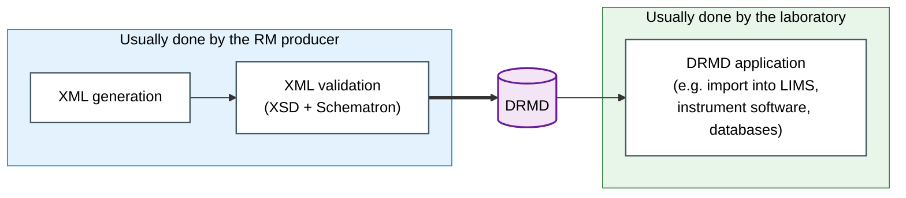

# Introduction & Overview

Welcome to the **Guidance Document** for the **Digital Reference Material Document (DRMD)**.

This guide provides instructions for reference material producers, resellers, laboratories, machine manufacturers and software developers to ensure consistent, interoperable, and automated handling of DRMD certificates across different platforms.

    

        

            Digital
        

        

            The term Digital represents our process of converting standard PDF formats into fully machine-readable formats for automated data processing.
        

    

    

        

            Reference
            Material
        

        

            The Reference Material forms the core engine of this project, acting as the foundational source of truth for all data verification.
        

    

    

        

            Document
        

        

            The Document signifies the final structured layout specifically designed to output Certified Reference Materials (CRM) and Product Information Sheets.
        

    

!!! info "What is the DRMD?"
    The DRMD is a standardised XML format for the documentation that accompanies a reference material. Its content follows **ISO 33401:2024**, *Reference materials: Contents of certificates, labels and accompanying documentation*, which is the standard that says what an RM certificate and a product information sheet must contain.

    ISO 33401:2024 is complementary to **ISO 17034:2016**, *General requirements for the competence of reference material producers*: ISO 17034 governs how a producer works, ISO 33401 governs what the resulting document says. Two further standards are referenced where they apply: **ISO Guide 35:2017** for characterisation, homogeneity and stability, and **ISO/IEC Guide 98-3 (GUM)** for the expression of measurement uncertainty.

## What the DRMD enables

The DRMD schema enables PDF certificates and product information sheets to be represented in a machine-readable manner. This has the following advantages:

- **Automated parsing** without manual data entry.
- **Seamless LIMS integration** for analytical laboratories.
- **Standardized data exchange** between producers, resellers and end-users.

### How it works

The diagram shows the process steps. Who carries out a step is shown by the grouping: the steps on
the left are usually done by the RM producer, the step on the right usually by the laboratory.

!!! note
    Other stakeholders, such as RM resellers, may also create and apply DRMDs.

## Target Audience

This guidance document is written for several stakeholders across the quality infrastructure:

=== "Machine Manufacturers & Software"
    Developers of LIMS, ELN, and analytical instrument software who need to confidently import, parse, and process DRMD certificates.

=== "Reference Material Producers"
    RM producers use the DRMD to safeguard maximum interoperability and reach of their documents.

=== "Laboratories"
    Laboratories benefit from automatic data entry into their systems: easy and efficient.

=== "RM Resellers"
    Resellers enjoy the efficient exchange of RM documents and their integration in their databases: efficient and user-friendly.

=== "Auditors & Regulators"
    Quality Assurance personnel responsible for verifying data integrity, cryptographic signatures, and maintaining audit trails for compliance.

---

## The four-tier severity model

With an XML Schema one can check if a document is well formed and structurally complete. It cannot be used to express *"if this is a certificate, then metrological traceability is required"*. XSD 1.0 has no way to make one requirement depend on the value of another element. That conditional logic lives in the companion **Schematron** file, `drmd-business-rules.sch`.

Each rule carries a severity that maps directly onto an ISO 33401:2024 requirement level, so a validation report can be read against the standard without interpretation.

!!! failure "Hard error, `role="error"`"
    **ISO level: Mandatory.** The document is non-compliant and must fail conformance validation. Example: a certificate without a `metrologicalTraceability` statement (RMC-001), or a material with no identifier of its own (DRMD-016).

!!! warning "Conditional error, `role="conditional-error"`"
    **ISO level: Mandatory whenever applicable.** Required if the requirement applies to *this* material. Where it genuinely does not apply, absence is acceptable, and it is the producer, not the validator, who makes that judgement. Example: `minimumSampleSize` (DRMD-008), `commutability` (DRMD-013).

!!! tip "Warning, `role="warning"`"
    **ISO level: Recommended.** The document is compliant. The element is recommended and makes the document more useful. Example: `healthAndSafetyInformation` (DRMD-015).

!!! note "No rule"
    **ISO level: Optional.** Accepted when present, never flagged when absent. Example: `legalNotice`, `subcontractors`.

`conditional-error` is a custom role. The Schematron specification allows any string in `@role`, and standard processors report it as an ordinary failed assertion. A validation pipeline must read the `role` attribute and classify accordingly: a tool that treats every failed assertion as a hard error will wrongly reject documents where a conditional requirement genuinely does not apply.

---

## How to read this guide

In the following chapters, we will break down the DRMD schema into its **Six Core Containers**, with examples, XML snippets and rules for implementation:

1. **Administrative Data**
2. **Materials**
3. **Properties List**
4. **Statements**
5. **Comments & Documents**
6. **Digital Signature**

Click **Next** below to start with the schema overview and architecture.

---

## Where things live

| Repository | Holds |
|---|---|
| **Schema** | `drmd.xsd`, `drmd-business-rules.sch`, the vendored supporting schemas, worked examples, the rule test suite, and the validation tools. |
| **Guidance document** (this site) | This guidance, the interactive schema tree, and the implementation checklists. |

The current specification version is **1.0.0**, the first release.
