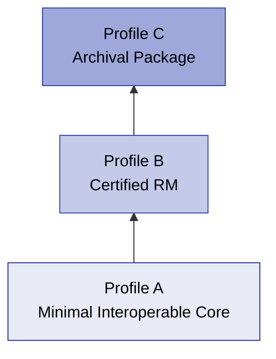

# Interoperability Profiles

The DRMD schema is intentionally flexible, featuring many optional fields and allowing rich narrative content. However, for automated processing and consistent behavior across software platforms, reference material producers and consumers **MUST agree on a profile**.

This chapter defines three **cumulative interoperability profiles** (A, B, and C). These profiles define exactly which information must be present in a structured, machine-readable form, and which information may remain human-readable text.

## Profile Architecture

- **Profile A** defines the minimum interoperable core.
- **Profile B** adds requirements typically needed for Certified Reference Materials (CRM).
- **Profile C** adds requirements for archival packaging and integrity (embedded PDFs and digital signatures).

!!! info "Profiles are stricter than ISO 33401:2024, on purpose"
    ISO 33401:2024 says what a document must **contain**. It does not say how machine-readable
    that content has to be, because it was written for documents that may be read by a person.
    These profiles add that second dimension: they say which information must be in a structured,
    parsable form rather than buried in narrative text.

    A profile therefore asks for things ISO 33401:2024 lists as Optional. That is deliberate and
    is not a claim about the standard. A document can be fully ISO 33401:2024 compliant and still
    fail Profile B, the two answer different questions.

!!! tip "D-SI throughout"
    Across all three profiles, values, units and uncertainties should be expressed with D-SI
    conventions. See [Units, Quantities & Uncertainty](units_quantities.md).

---

## 9.1 Profile A: Minimal Interoperable Core

**Goal:** Enable reliable automated ingestion (parsing and extraction) of essential Reference Material information with minimal constraints.

### Profile A: MUST (required minimum fields)

If a parser processes a Profile A document, it can strictly rely on the following elements being present:

| Component | Required elements |
|-----------|-------------------|
| **Root** | `@schemaVersion` |
| **Administrative Data** | `titleOfTheDocument`, `uniqueIdentifier`, `documentVersion`, `validity`, `referenceMaterialProducer/name`, `referenceMaterialProducer/contact` |
| **Materials** | At least one `material`, with `name` and at least one `materialIdentifier` |
| **Properties** | At least one `properties` block, with `name`, at least one `result` with a `name`, and a `data` block holding either `quantity` or `list/quantity` |
| **Statements** | `intendedUse`, `storageInformation`, `instructionsForHandlingAndUse` |

Every one of these is Mandatory in ISO 33401:2024, Table 1 for both document types, so Profile A
adds no requirement of its own here, it simply states what a parser may rely on.

### Profile A (conditional)

These are ISO *Mandatory whenever applicable* items. A Profile A document must either provide
them, or say in the document why they do not apply:

- `material/minimumSampleSize` (5.2.7)
- `statements/commutability` (5.2.9)
- `properties/procedures` (5.2.14, 5.4.2)

### Profile A: SHOULD (strong recommendations)

- **Quantities:** use `si:real` for a single value, or `si:realListXMLList` for a list of values
  of one quantity. `si:real` always contains `si:value` and `si:unit`.
- **Unit strings:** meet at least the D-SI **Silver** class: every unit is a machine-readable
  D-SI string. Note that neither the XSD nor the Schematron checks this, so it has to be checked
  in your own tooling.
- **Numeric formatting:** the decimal separator is a dot. `INF` is rejected by the D-SI decimal
  pattern. `NaN` is *accepted* by that pattern, but producers should never emit it, where a value
  could not be determined, use `dcc:noQuantity` with an explanation instead.
- **Responsible persons:** include `respPersons` even on a product information sheet, where
  ISO 33401:2024 lists it as Optional. It costs little and tells a reader who stands behind the
  document.

---

## 9.2 Profile B: Certified RM

**Goal:** Support certified reference materials where users need certified values, uncertainty, traceability, and unambiguous property identification. 

Profile B **includes all Profile A requirements**, plus the following:

### Profile B: MUST and SHOULD

!!! danger "Certification Rules (CRM Profile)"
    Profile B aligns closely with the CRM Schematron profile rules (`RMC-*`).

| Requirement | Description |
|-------------|-------------|
| **Certified Flag** | Each `properties` block SHOULD include `@isCertified`. At least one block **MUST** have `@isCertified="true"` (`RMC-002`). |
| **Machine-Readable Uncertainty** | Certified values **MUST** carry an uncertainty, rules RMC-006 to RMC-009 make this a hard error, so it is not merely recommended. Use `si:measurementUncertaintyUnivariate`; inside `si:expandedMU`, D-SI requires **both** `si:coverageFactor` and `si:coverageProbability`. |
| **Quantity Kinds** | Every certified value SHOULD carry an `si:quantityTypeQUDT`, so a consumer knows what was measured and not only in what unit. |
| **D-SI Unit Quality** | For certified values, aim for the D-SI **Gold** class. Do not chase Platinum for its own sake: forcing a mass fraction into base units where the field reports mg/kg makes the certificate harder to read without making it more correct. |
| **Unambiguous Property Identifiers** | For each `quantity` in result tables, producers SHOULD include `propertyIdentifiers` (at least `scheme` and `value`). Recommended schemes include CAS, InChI, or stable internal producer codes. |
| **Traceability Statement** | Producers SHOULD populate `metrologicalTraceability` (`RMC-001`). |
| **Certification Report Reference** | Producers SHOULD populate `referenceToCertificationReport`. |

---

## 9.3 Profile C: Archival Package

**Goal:** Enable long-term preservation and offline use by packaging machine-readable XML, the human-readable representation, and integrity protection into a single file. 

Profile C **includes all Profile B requirements**, plus the following:

### Profile C: SHOULD and MUST

| Requirement | Description |
|-------------|-------------|
| **Embedded Human-Readable Document** | Producers SHOULD include a `document` (`dcc:byteDataType`) holding the PDF representation; if several `document` elements are present, the official RM document comes first. `fileName`, `mimeType` and `dataBase64` are all required by the type, and they appear in that order after the optional `name` and `description`. |
| **Embedded Attachments** | Producers MAY embed additional documents (SDS, reports, handling instructions) as further `document` elements, or as `dcc:file` inside the relevant `dcc:richContentType` statement elements. |
| **Digital Signature** | Producers SHOULD include at least one `ds:Signature`. Consumers verifying Profile C in production **MUST** perform cryptographic signature verification (offline XSD stub validation is insufficient). |
| **Multilingual Completeness** | If multiple languages are used, producers SHOULD apply them consistently across key fields (material name, key statements, main result headings) to avoid partial translations. |
| **D-SI Strictness** | Profile C documents SHOULD be fully consistent with D-SI unit-string and numeric formatting rules. |
| **Version Fixity** | The embedded PDF and the XML MUST be the same revision. `documentVersion` should appear in both, so a mismatch is visible without comparing content. |

---

## 9.4 Conformance Language and Testing

### 9.4.1 Normative Keywords

- **MUST:** Required for profile conformance.
- **SHOULD:** Recommended for interoperability; deviations must be justified.
- **MAY:** Optional.

### 9.4.2 Testing Approach

1. **XSD Validation:** Validate against the DRMD XSD and imported schemas. Checks structural correctness.
2. **Profile Validation (Business Rules):** Apply Schematron checks according to Profile A/B/C requirements (e.g., checking for certified blocks, uncertainty presence, property identifiers).
3. **Cryptographic Verification (Profile C):** If signatures are present and Profile C is claimed, perform XML Digital Signature verification using a trusted certificate policy.

### 9.4.3 Recommended Conformance Report Output

A robust DRMD validator SHOULD produce a conformance report including:
- Declared profile (A/B/C)
- Pass/fail result
- List of violations with:
    - Severity (ERROR/WARNING)
    - XPath to the offending location
    - Short description of the issue and expected requirement
