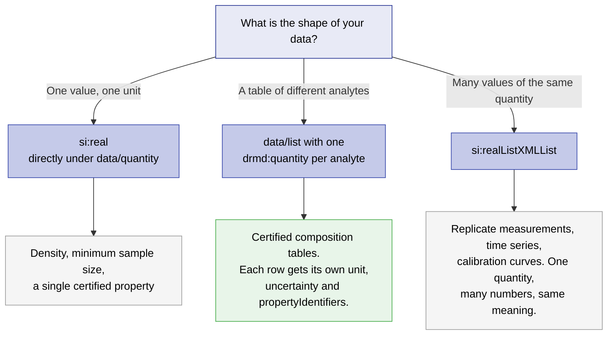

# Units, Quantities & Uncertainty

A number in a certificate is only usable if a machine can tell what it measures, in what unit,
and how well it is known. DRMD does not invent its own way of writing that down: it uses the
**Digital System of Units (D-SI)** for the value, the unit and the uncertainty, and the **QUDT**
quantity-kind vocabulary for what kind of quantity it is.

This chapter covers four things that are easy to get wrong:

1. Writing unit strings that a machine can parse.
2. Saying **what** was measured, not only in what unit, the difference between a unit and a
   quantity kind.
3. Reporting a unit that D-SI cannot express.
4. Reporting uncertainty in the form D-SI actually requires.

---

## 11.1 Unit strings (`si:unit`)

Unit strings appear in `si:real/si:unit` and in the list variants. They must follow D-SI syntax.

!!! danger "The XSD does not check this"
    `si:unitType` is an unrestricted `xs:string`. Any text at all passes XSD validation, and
    `drmd-business-rules.sch` does not check unit syntax either. Writing `mg/kg` or `%` instead of
    a D-SI string produces a document that validates cleanly and is still unreadable by any
    consumer expecting D-SI.

    This is the single most common source of silently broken DRMD documents. If you build tooling
    around DRMD, a unit-string check is the highest-value thing you can add on top of the two
    validation layers.

### 11.1.1 Syntax

| Rule | Description |
|---|---|
| **Identifiers** | Every unit and prefix is an ASCII, lower-case identifier introduced by a backslash: `\metre`, `\gram`, `\micro`. |
| **Multiplication** | Units are multiplied by writing them one after another: `\newton\metre` is N·m. |
| **Exponents** | `\tothe{n}` raises the preceding unit to a power. No spaces inside the braces. The exponent may be negative or fractional: `\tothe{2}`, `\tothe{-1}`, `\tothe{0.5}`. |
| **Division** | There is no division operator. Divide by using a negative exponent: mg/kg is `\milli\gram\kilo\gram\tothe{-1}`. |
| **Decimal separator** | The value in `si:value` uses a dot. A comma is not accepted by the D-SI decimal pattern. |

!!! example "Worked unit strings"
    | Quantity | D-SI string |
    |---|---|
    | micrometre, µm | `\micro\metre` |
    | square metre, m² | `\metre\tothe{2}` |
    | kilometre per hour, km/h | `\kilo\metre\hour\tothe{-1}` |
    | pascal written out, kg·m⁻¹·s⁻² | `\kilogram\metre\tothe{-1}\second\tothe{-2}` |
    | milligram per kilogram, mg/kg | `\milli\gram\kilo\gram\tothe{-1}` |
    | percent | `\percent` |
    | dimensionless | `\one` |

### 11.1.2 Values, and the `NaN` question

`si:value` is typed `si:decimalType`, which restricts `xs:double` with this pattern:

```
[-+]?((\d*\.\d+)|(\d+\.\d*)|(\d+\.?))([Ee][-+]?\d+)?|NaN
```

Read it carefully, because two claims are often made about it and only one is true:

* **`INF` is not permitted.** The pattern has no branch for it. A document containing `INF` fails
  XSD validation.
* **`NaN` *is* permitted.** The pattern ends with an explicit `NaN` alternative.

So a validator must not reject `NaN` as schema-invalid, it is not. But a certified value of
`NaN` is meaningless, and **producers should never emit it**. Where a value could not be
determined, say so in a form a reader can act on: use `dcc:noQuantity` with an explanation, or
omit the row and describe the gap in the properties block description. A consumer that encounters
`NaN` in a certified value should treat it as a data-quality problem and raise it, not silently
convert it to zero or to a missing value.

---

## 11.2 Prefixes

| Rule | Detail |
|---|---|
| **One prefix per unit** | `\milli\kilo\gram` is invalid: a unit takes at most one prefix. |
| **Mass is built on `\gram`** | `\kilogram` is a single unit identifier and takes no prefix. Multiples and submultiples of mass are formed from `\gram`: `\milli\gram`, `\mega\gram`. `\kilo\gram` is written as such where it appears in a compound expression; `\kilogram` is the SI base unit identifier. |
| **Some units take no prefix** | `\one`, `\percent`, `\degreecelsius`, `\hour`, `\day` and the other time and angle units accepted for use with the SI are used without a prefix. |
| **Prefix before the unit** | Always `\milli\metre`, never `\metre\milli`. |

---

## 11.3 D-SI quality classes

The D-SI specification defines five quality classes for how expressive a unit statement is. They
are useful as a target to aim at, and as a way of describing what a consuming system can rely on.

| Class | What it allows |
|---|---|
| **Platinum** | Only the seven SI base units, `\one`, and specific angle and time units. No prefixes. The most machine-tractable form: every value is directly comparable without conversion. |
| **Gold** | SI units with prefixes, plus SI derived units, as defined in the SI brochure. |
| **Silver** | Adds units outside the SI that are accepted for use with it, such as `\litre`, `\tonne` and `\electronvolt`. |
| **Bronze** | Adds units from the previous edition of the SI brochure that are no longer current. |
| **Improvable** | Anything else, including values with no unit at all. |

**What DRMD asks for.** Reference material data covers chemistry, physics and biology, and Silver
is what most real certificates can reach without distorting how a field normally reports its
results.

* Aim for **Silver or better** throughout. Every value should have a machine-readable D-SI unit.
* For **certified values**, aim for **Gold**: SI units, with prefixes and derived units, and no
  units from outside the SI unless the field genuinely requires them.
* **Platinum is not a goal in itself.** Forcing a mass fraction into base units where the field
  reports mg/kg makes the certificate harder for its readers without making it more correct.
* If a value falls into **Improvable** (no unit at all, or a unit only a human can interpret),
  treat that as a defect to fix, not a style choice. Section 11.5 shows how to report an unusual unit
  without dropping to this class.

---

## 11.4 Quantity kinds: saying what was measured

A unit tells you the dimension. It does not tell you what the number is *about*. `\percent` could
be a mass fraction, a volume fraction, a recovery, or a relative uncertainty. A consuming system
cannot guess, and guessing wrong is a real risk in an automated pipeline.

D-SI solves this with `si:quantityTypeQUDT`, typed against the **QUDT quantity-kind vocabulary**.
It sits inside any D-SI quantity, before the value:

```xml
<si:real>
  <si:label>Mass fraction of Si</si:label>
  <si:quantityTypeQUDT>MassFraction</si:quantityTypeQUDT>
  <si:value>6.42</si:value>
  <si:unit>\percent</si:unit>
</si:real>
```

!!! info "How QUDT reaches DRMD"
    DRMD does not import QUDT itself. D-SI declares `si:quantityTypeQUDT`, `si:listQuantityTypeQUDT`
    and `si:quantityTypeQUDTXMLList` with the type `qudt:quantitykind`, so QUDT is available
    anywhere a D-SI quantity is, which in DRMD means every value in `propertiesList`,
    `minimumSampleSize` and `itemQuantities`.

    The schema repository vendors the QUDT quantity-kind type in `supporting/quantitykind.xsd`.
    It accepts either the QUDT local name (recommended, e.g. `MassFraction`) or the full IRI
    (`http://qudt.org/vocab/quantitykind/MassFraction`). The vocabulary holds 1158 quantity kinds;
    browse it at <https://qudt.org/vocab/quantitykind/>.

!!! danger "A quantity kind is not a unit"
    `si:quantityTypeQUDT` never replaces `si:unit`. They answer different questions: the quantity
    kind says *what* was measured, the unit says *in what*. Both are needed, and `si:unit` remains
    mandatory inside `si:real`.

**When to use it.** State a quantity kind for every certified value. It costs one line and
removes the largest remaining ambiguity in an automated import. It is equally valuable on
`minimumSampleSize`, where `Mass` and `Volume` are otherwise distinguishable only by reading the
unit.

Quantity kinds that come up constantly in reference material work:

| QUDT quantity kind | Typical use |
|---|---|
| `MassFraction` | Composition given as a mass ratio (%, mg/kg, µg/g) |
| `AmountOfSubstanceConcentration` | Concentration in mol/L |
| `MassConcentration` | Concentration in mg/L, g/L |
| `Mass` | Minimum sample size, item mass |
| `Density` | Bulk or particle density |
| `Length`, `Diameter`, `Thickness` | Physical dimensions of a unit |
| `Temperature` | Storage or measurement conditions |
| `VolumeFraction` | Composition given as a volume ratio |

---

## 11.5 Reporting a unit D-SI cannot express

Some fields report results on scales that are not units in the SI sense at all: Brinell hardness,
IU/mL for a biological activity, degrees Brix, an octane number. D-SI has a defined answer for
this, and it is **not** to write the unusual unit into `si:unit` and hope.

**Use `si:hybrid`.** A hybrid carries the same quantity more than once, in different units. At
least one `si:real` inside it must give the value in a machine-readable SI unit; the others may
use any unit at all. The SI sibling is what keeps the value computable; the other preserves the
form the field expects.

```xml
<drmd:quantity id="q_hardness">
  <dcc:name><dcc:content lang="en">Hardness HBW 2.5/62.5</dcc:content></dcc:name>
  <si:hybrid>
    <si:real>
      <si:label>Brinell hardness, expressed in SI units</si:label>
      <si:value>1.03e9</si:value>
      <si:unit>\pascal</si:unit>
    </si:real>
    <si:real>
      <si:label>Brinell hardness, expressed in the conventional hardness scale</si:label>
      <si:value>105</si:value>
      <si:unit>HBW 2.5/62.5</si:unit>
    </si:real>
  </si:hybrid>
</drmd:quantity>
```

**Define the unusual unit.** Put the definition in the surrounding
`properties/measurementMetaData`, using the two DCC elements that exist for exactly this:

```xml
<drmd:measurementMetaData>
  <dcc:metaData>
    <dcc:name>
      <dcc:content lang="en">Definition of the non-SI unit used above</dcc:content>
    </dcc:name>
    <dcc:nonSIDefinition>Brinell hardness measured with a 2.5 mm tungsten carbide ball at a
      test force of 62.5 kgf (612.9 N), reported on the conventional HBW scale as defined in
      ISO 6506-1. The SI-encoded sibling quantity states the same result in pascal.</dcc:nonSIDefinition>
    <dcc:nonSIUnit>HBW 2.5/62.5</dcc:nonSIUnit>
  </dcc:metaData>
</drmd:measurementMetaData>
```

!!! tip "Choosing the right mechanism"
    | Situation | What to use |
    |---|---|
    | Unit is in the SI, or accepted for use with it | `si:real` with a D-SI `si:unit`. Nothing else needed. |
    | Unit is conventional or field-specific, but the quantity has an SI equivalent | `si:hybrid`: one SI-encoded `si:real`, one in the conventional unit, plus `dcc:nonSIUnit` / `dcc:nonSIDefinition` in the metadata. |
    | The property is genuinely not numeric (an identity, a class, a pass/fail) | `dcc:noQuantity` with an explanation, or `dcc:charsXMLList` for a token list. |
    | The quantity kind is unclear from the unit alone | Add `si:quantityTypeQUDT`. This applies in every case above where a D-SI quantity is used. |

---

## 11.6 Uncertainty

For `si:real`, the uncertainty is an optional choice of three elements. Only the first is current:

| Element | Status |
|---|---|
| `si:measurementUncertaintyUnivariate` | **Use this.** The current D-SI form. |
| `si:expandedUnc` | Deprecated in D-SI. Accepted for backward compatibility. |
| `si:coverageInterval` | Deprecated in D-SI. Accepted for backward compatibility. |

!!! danger "Schematron: certified values must carry uncertainty"
    In a `referenceMaterialCertificate`, every quantity inside a `properties` block with
    `@isCertified="true"` must include one of those three elements. Four rules cover the four
    encodings: **RMC-006** (`si:real` directly under `data`), **RMC-007** (`si:real` inside a
    `list`), **RMC-008** (`si:realListXMLList`), **RMC-009** (every `si:real` nested in an
    `si:hybrid`). All four are hard errors.

### 11.6.1 What goes inside

`si:measurementUncertaintyUnivariate` is a choice of exactly one of three structures.

=== "expandedMU, the usual choice"

    All three of `valueExpandedMU`, `coverageFactor` and `coverageProbability` are **required**
    by D-SI. This is not a recommendation: omitting `coverageFactor` or `coverageProbability`
    makes the document XSD-invalid. `distribution` is optional.

    ```xml
    <si:real>
      <si:quantityTypeQUDT>MassFraction</si:quantityTypeQUDT>
      <si:value>6.42</si:value>
      <si:unit>\percent</si:unit>
      <si:measurementUncertaintyUnivariate>
        <si:expandedMU>
          <si:valueExpandedMU>0.08</si:valueExpandedMU>
          <si:coverageFactor>2</si:coverageFactor>
          <si:coverageProbability>0.95</si:coverageProbability>
          <si:distribution>normal</si:distribution>
        </si:expandedMU>
      </si:measurementUncertaintyUnivariate>
    </si:real>
    ```

=== "standardMU"

    The standard uncertainty, with no coverage factor. `valueStandardMU` is required;
    `distribution` is optional.

    ```xml
    <si:measurementUncertaintyUnivariate>
      <si:standardMU>
        <si:valueStandardMU>0.04</si:valueStandardMU>
        <si:distribution>normal</si:distribution>
      </si:standardMU>
    </si:measurementUncertaintyUnivariate>
    ```

=== "coverageIntervalMU"

    An explicit interval, for asymmetric uncertainties. `valueStandardMU`, `intervalMin`,
    `intervalMax` and `coverageProbability` are all required.

    ```xml
    <si:measurementUncertaintyUnivariate>
      <si:coverageIntervalMU>
        <si:valueStandardMU>0.04</si:valueStandardMU>
        <si:intervalMin>6.30</si:intervalMin>
        <si:intervalMax>6.52</si:intervalMax>
        <si:coverageProbability>0.95</si:coverageProbability>
      </si:coverageIntervalMU>
    </si:measurementUncertaintyUnivariate>
    ```

### 11.6.2 Say what the uncertainty means, once

The numbers say *k* = 2 and *p* = 0.95, but they do not say what the uncertainty covers. State
that once, in the `description` of the `properties` block, rather than repeating it per row:

```xml
<drmd:description>
  <dcc:content lang="en">U is the expanded uncertainty of the certified value, calculated with a
    coverage factor k = 2, corresponding to a coverage probability of approximately 95 percent.
    It includes contributions from characterisation, between-unit homogeneity and long-term
    stability over the period of validity.</dcc:content>
</drmd:description>
```

ISO 33401:2024, 5.3.3 recommends reporting uncertainties in accordance with ISO/IEC Guide 98-3
(GUM). The `dcc:formula` element is available if you want to state the uncertainty budget
mathematically.

---

## 11.7 Single values, tables and lists

Three encodings are available. Choosing the wrong one is the second most common structural
mistake in DRMD documents, after unit strings.



!!! danger "`si:realListXMLList` holds space-separated lists, not repeated elements"
    Each of `si:valueXMLList` and `si:unitXMLList` appears **once** and contains a
    whitespace-separated list. Repeating the elements is invalid.

    ```xml
    <!-- Wrong: these elements do not repeat -->
    <si:realListXMLList>
      <si:valueXMLList>0.81</si:valueXMLList>
      <si:valueXMLList>0.82</si:valueXMLList>
    </si:realListXMLList>

    <!-- Correct -->
    <si:realListXMLList>
      <si:valueXMLList>0.81 0.82 0.79</si:valueXMLList>
      <si:unitXMLList>\one \one \one</si:unitXMLList>
    </si:realListXMLList>
    ```

    Keep every list in the same quantity the same length: values, units, and any uncertainty
    list must line up position by position.

!!! tip "Do not mix encodings inside one result"
    Within one `drmd:result`, use either repeated `drmd:quantity` rows or a list encoding, not
    both. For a certified composition table, repeated `drmd:quantity` rows are almost always
    right: each row can carry its own unit, its own uncertainty and its own
    `propertyIdentifiers`, which a flat list cannot.

---

## 11.8 Checklist

- [ ] Every `si:unit` is a D-SI string, starting with a backslash.
- [ ] Division is written with a negative exponent, not a slash.
- [ ] No unit carries two prefixes; mass submultiples are built on `\gram`.
- [ ] `si:value` uses a decimal dot. No `INF`. No `NaN` in a certified value.
- [ ] Every certified value has an `si:quantityTypeQUDT`.
- [ ] Any unit outside D-SI is reported through `si:hybrid` with an SI-encoded sibling, and
      defined with `dcc:nonSIUnit` and `dcc:nonSIDefinition`.
- [ ] Every certified value has an uncertainty, and `expandedMU` carries both `coverageFactor`
      and `coverageProbability`.
- [ ] The meaning of the uncertainty is stated once, in the `properties` description.
- [ ] Lists in one quantity all have the same length.
