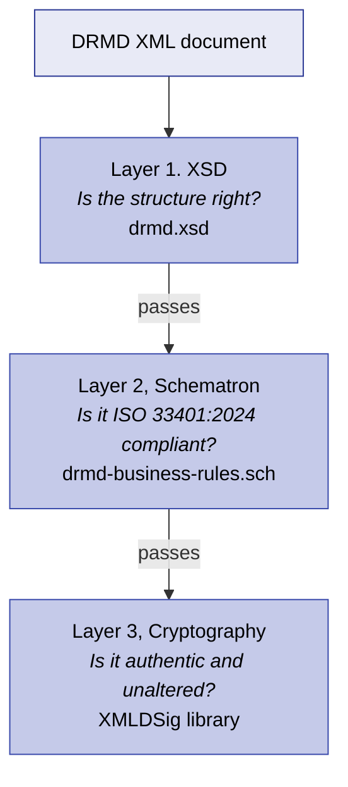

# Validation Rules & Severity

XSD validation tells you a document is structurally correct. It does not tell you the document is
compliant with ISO 33401:2024, and it certainly does not tell you the document is trustworthy.
Three separate layers are involved, and each answers a different question.



Layers 1 and 2 are both required for conformance. Layer 3 applies where signatures are used.

---

## 12.1 Layer 1 (XSD)

### What it does

A validator must validate the instance against `drmd.xsd` and resolve the imports for `dcc.xsd`,
`SI_Format.xsd`, `quantitykind.xsd` and `xmldsig-core-schema.xsd`. It enforces element names,
sequence order, cardinalities and data types.

!!! warning "Resolve imports from the local bundle, not the network"
    `drmd.xsd` does not compile at all if the QUDT quantity-kind type cannot be resolved: D-SI
    declares `si:quantityTypeQUDT` with that type, and an unresolvable type reference invalidates
    the entire schema. Use the schema repository's `catalog.xml`, which maps every remote address
    to the vendored copy:

    ```bash
    export XML_CATALOG_FILES=/path/to/schema/catalog.xml
    xmllint --noout --nonet --schema drmd.xsd my-document.xml
    ```

    Fetching schemas at validation time is worse than inconvenient: an upstream revision can
    change what counts as valid between two runs of the same check.

### What it does not do

XSD validation **cannot** tell you:

* whether a text field is empty or meaningless, `<dcc:content lang="en"></dcc:content>` passes;
* whether an `si:unit` string is valid D-SI, `si:unitType` is an unrestricted `xs:string`, so
  `mg/kg` and `banana` both pass;
* whether a certified value has an uncertainty: the choice is optional in D-SI;
* whether the right elements are present *for this document type*. XSD 1.0 cannot make a
  requirement conditional on another element's value;
* whether a signature is cryptographically valid.

The last two points are why layers 2 and 3 exist. The first two are not covered by any layer of
DRMD validation, see [What is not checked](#124-what-is-not-checked) below.

---

## 12.2 Layer 2 (Schematron)

`drmd-business-rules.sch` reads `titleOfTheDocument` and applies the ISO 33401:2024 requirements
for that document type. Run it immediately after a successful XSD validation.

### The four-tier severity model

| Tier | `role` | ISO 33401:2024 level | Effect on conformance |
|---|---|---|---|
| Hard error | `error` | Mandatory | **Non-compliant.** Reject. |
| Conditional error | `conditional-error` | Mandatory whenever applicable | **Non-compliant unless the requirement genuinely does not apply to this material.** |
| Warning | `warning` | Recommended | Compliant. Recommended information is missing. |
| No rule | none | Optional | Never reported. |

!!! info "`conditional-error` is a custom role, and that is allowed"
    The Schematron specification permits any string in `@role`. Standard processors emit it
    verbatim in the SVRL `failed-assert/@role` attribute and report the assertion like any other.

    A pipeline **must** branch on `@role`. A tool that treats every failed assertion as a hard
    error will reject documents where a conditional requirement legitimately does not apply, for
    example a gaseous RM with no meaningful minimum sample size.

### Handling a conditional error

A conditional error is a question put to the producer: *does this apply to your material?*

* **It applies** → add the information. The document is not compliant without it.
* **It does not apply** → say so in the document rather than leaving the element out. A
  `commutability` statement reading *"commutability has not been assessed for this material; use
  is restricted to the procedures validated for this matrix"* is more useful to the reader than
  silence, and it clears the rule. Where the element must genuinely be omitted, record the
  justification in your own quality records: an auditor will ask, and an absent element cannot
  distinguish *not applicable* from *forgotten*.

---

## 12.3 The complete rule catalogue

Thirty-one rules. Each one is exercised by the schema repository's test suite
(`tests/test_rules.py`), which breaks one thing at a time in a copy of a worked example and
checks that the expected rule fires.

### Shared rules (every DRMD document)

| Rule | Severity | ISO | Checks | Chapter |
|---|---|---|---|---|
| DRMD-001 | error | 5.2.2 | `titleOfTheDocument` is declared | [Administrative Data](administrative_data.md) |
| DRMD-002 | error | 5.2.4 | At least one `material` entry exists | [Materials](materials.md) |
| DRMD-003 | error | 5.2.15 | At least one `properties` block exists | [Properties](properties.md) |
| DRMD-004 | error | 5.2.6 | `intendedUse` is present | [Statements](statements.md) |
| DRMD-005 | error | 5.2.10 | `storageInformation` is present | [Statements](statements.md) |
| DRMD-006 | error | 5.2.11 | `instructionsForHandlingAndUse` is present | [Statements](statements.md) |
| DRMD-007 | error | 5.2.4 | Every material has a `name` | [Materials](materials.md) |
| DRMD-008 | conditional-error | 5.2.7 | `minimumSampleSize` where applicable | [Materials](materials.md) |
| DRMD-009 | error | 5.2.15 | Every `properties` block has a `result` | [Properties](properties.md) |
| DRMD-010 | error | 5.2.5 | `referenceMaterialProducer` is identified | [Administrative Data](administrative_data.md) |
| DRMD-011 | error | 5.2.13 | `documentVersion` is stated | [Administrative Data](administrative_data.md) |
| DRMD-012 | error | 5.2.8 | `validity` is specified | [Administrative Data](administrative_data.md) |
| DRMD-013 | conditional-error | 5.2.9 | `commutability` where applicable | [Statements](statements.md) |
| DRMD-014 | conditional-error | 5.2.14, 5.4.2 | `procedures` where applicable | [Properties](properties.md) |
| DRMD-015 | warning | 5.4.3 | `healthAndSafetyInformation` is included | [Statements](statements.md) |
| DRMD-016 | error | 5.2.3 | Every material carries a `materialIdentifier` | [Materials](materials.md) |

### Certificate-only rules (`referenceMaterialCertificate`)

| Rule | Severity | ISO | Checks | Chapter |
|---|---|---|---|---|
| RMC-001 | error | 5.3.4 | `metrologicalTraceability` is present | [Statements](statements.md) |
| RMC-002 | error | 5.3.3 | At least one block has `isCertified="true"` | [Properties](properties.md) |
| RMC-003 | error | 5.3.3 | Property values exist | [Properties](properties.md) |
| RMC-005 | warning | 5.4.2 | Certified blocks document `procedures` | [Properties](properties.md) |
| RMC-006 | error | 5.3.3 | Certified `si:real` carries uncertainty | [Units & Uncertainty](units_quantities.md) |
| RMC-007 | error | 5.3.3 | Certified `si:real` in a list carries uncertainty | [Units & Uncertainty](units_quantities.md) |
| RMC-008 | error | 5.3.3 | Certified `si:realListXMLList` carries uncertainty | [Units & Uncertainty](units_quantities.md) |
| RMC-009 | error | 5.3.3 | Every `si:real` in a certified `si:hybrid` carries uncertainty | [Units & Uncertainty](units_quantities.md) |
| RMC-010 | error | 5.3.5 | `respPersons` lists the approving officer | [Administrative Data](administrative_data.md) |
| RMC-011 | error | 5.3.2 | Every material has a `description` | [Materials](materials.md) |
| RMC-012 | error | 5.3.5 | A responsible person states a function (`dcc:role`) | [Administrative Data](administrative_data.md) |

### Product information sheet rules (`productInformationSheet`)

| Rule | Severity | ISO | Checks | Chapter |
|---|---|---|---|---|
| PIS-001 | error | 3.3 | No block is marked `isCertified="true"` | [Properties](properties.md) |
| PIS-002 | error | 5.2.15 | Results exist where values are assigned | [Properties](properties.md) |
| PIS-003 | error | 3.3 | No individual block claims certification | [Properties](properties.md) |
| PIS-005 | warning | 5.3.2 | Every material has a `description` | [Materials](materials.md) |

!!! note "Gaps in the numbering are intentional"
    **RMC-004** and **PIS-004** were used during development and are permanently retired. Rule
    identifiers are never reused, so that a stored validation report stays readable after a rules
    update.

### Selective validation with phases

The Schematron file defines three phases, so a pipeline can run only what it needs:

| Phase | Patterns activated |
|---|---|
| `all` | Everything (the default) |
| `rmc-only` | Shared rules plus the certificate rules |
| `pis-only` | Shared rules plus the product information sheet rules |

```bash
python tools/validate.py --phase rmc-only my-certificate.xml
```

---

## 12.4 What is not checked

Being explicit about this matters more than listing what *is* checked, because the gaps are where
documents break quietly.

| Not checked by any layer | Why it matters | What to do |
|---|---|---|
| **D-SI unit syntax** | `si:unitType` is an unrestricted `xs:string`, and no Schematron rule inspects it. `mg/kg` and `%` validate cleanly and are unreadable to a D-SI consumer. | Add a regular-expression check in your own tooling. This is the highest-value addition you can make. |
| **Empty or placeholder text** | `<dcc:content lang="en"></dcc:content>` and `<dcc:content>TBD</dcc:content>` both pass. | Check for non-empty, non-placeholder content on the mandatory statements before publishing. |
| **Numeric plausibility** | Nothing checks that mass fractions sum sensibly, that an uncertainty is smaller than its value, or that a coverage factor is positive. | Add domain checks appropriate to your materials. |
| **Dangling `@refId`, under libxml2** | XSD 1.0 requires every IDREF to resolve, and Xerces enforces it, but libxml2 (`xmllint`, `lxml`, and so `tools/validate.py`) accepts a dangling reference silently. A typo passes your Python check and fails in a Java pipeline. | Validate once with Xerces before release, or add your own IDREF check. See [Cross-references](cross_references.md). |
| **Whether a resolved reference is *meaningful*** | No validator can tell that a properties block points at a document identifier rather than a material identifier. Both resolve. | Follow the conventions in [Cross-references](cross_references.md) and check them in your tooling. |
| **Whether a signature verifies** | XSD checks the *structure* of `ds:Signature`; it cannot recompute a digest. | Layer 3. See [Digital Signature](digital_signature.md). |
| **Whether the values are true** | No schema can check a measurement. | ISO 17034, and the producer's quality system. |

---

## 12.5 Running the validation

### Recommended: the bundled validator

```bash
pip install lxml
python tools/validate.py my-document.xml
python tools/validate.py my-document.xml --json report.json
```

It runs both layers, classifies findings by severity, prints XPath locations and line numbers,
and exits non-zero when a document is not compliant. It needs only `lxml`; there is no XSLT
skeleton to download and no network access required.

### Saxon and the ISO Schematron skeleton

```bash
java -jar saxon.jar -s:drmd-business-rules.sch \
     -xsl:iso_schematron_skeleton_for_xslt2.xsl -o:drmd-rules.xsl
java -jar saxon.jar -s:my-document.xml -xsl:drmd-rules.xsl -o:report.svrl
```

Then read `svrl:failed-assert` and branch on `@role`.

!!! warning "`lxml.isoschematron` and the query binding"
    `lxml.isoschematron.Schematron` implements the XSLT 1.0 binding and refuses a file declaring
    `queryBinding="xslt2"`. Every test expression in `drmd-business-rules.sch` is deliberately
    written to be valid XPath 1.0 as well, so the rules themselves work under either binding, but
    you would need to change the declared binding, or use a processor that supports XSLT 2.0. The
    bundled `validate.py` sidesteps this by evaluating the rules directly.

---

## 12.6 Reporting findings

A validator should emit a machine-readable report that preserves the rule identifier, the
severity and an XPath to the offending node. Rule identifiers are stable and never reused, so a
stored report stays meaningful after a rules update.

```json
{
  "document": "EXA-1a-certificate.xml",
  "schemaVersion": "1.0.0",
  "xsd_valid": true,
  "compliant": false,
  "schematron_findings": [
    {
      "rule_id": "DRMD-016",
      "severity": "error",
      "location": "/drmd:digitalReferenceMaterialDocument/drmd:materials/drmd:material",
      "line": 96,
      "message": "Each material entry MUST carry at least one materialIdentifier giving the unique identifier of the reference material (ISO 33401:2024, 5.2.3)."
    },
    {
      "rule_id": "DRMD-013",
      "severity": "conditional-error",
      "location": "/drmd:digitalReferenceMaterialDocument/drmd:statements",
      "line": 210,
      "message": "Every DRMD document MUST include a commutability statement whenever applicable (ISO 33401:2024, 5.2.9)."
    },
    {
      "rule_id": "DRMD-015",
      "severity": "warning",
      "location": "/drmd:digitalReferenceMaterialDocument/drmd:statements",
      "line": 210,
      "message": "DRMD documents SHOULD include healthAndSafetyInformation (ISO 33401:2024, 5.4.3)."
    }
  ]
}
```

Where JSON is not practical, a table with the same columns, `Severity`, `Rule ID`, `Location`,
`Line`, `Message`, carries the same information.
